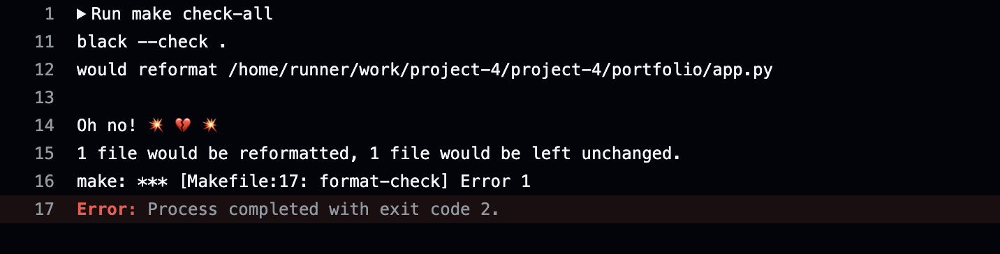
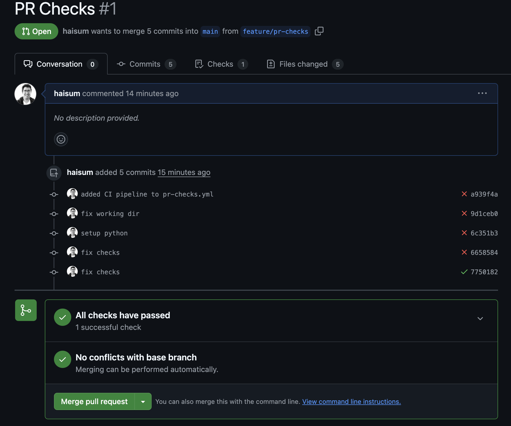
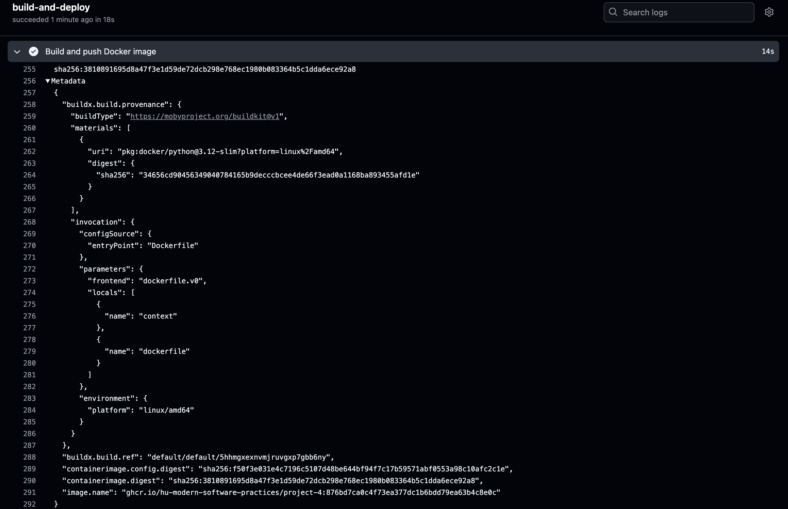

# Project 4

This project contains a Flask-based portfolio website which you will make CI/CD pipeline for. The app needs to be packaged as a Docker container and deployed to a Kubernetes cluster.

You have two Kubernetes clusters, one for development and one for production. You will set up CI/CD pipelines to deploy the app to both environments.

# Project Flow Overview

This project will guide you through implementing a complete CI/CD pipeline. Here's what you'll be doing:

1. **Development and Testing**
   - Create feature branches for your changes
   - Run automated tests and checks locally
   - Create Pull Requests to merge your changes

2. **Continuous Integration**
   - Automated checks run on your PRs
   - All checks must pass before merging

3. **Development Deployment**
   - Merging to main triggers the development pipeline
   - Docker image is built and pushed to GitHub Container Registry
   - Automatic deployment to development environment

4. **Production Release**
   - Create a version tag to trigger production deployment
   - Reuse the tested image from development
   - Deploy to production

## Exploring Code

1. Switch to portfolio directory:
```bash
cd portfolio
```

2. To run the app locally, follow these steps:
```bash
# Create a virtual environment
python -m venv .venv
source .venv/bin/activate  # On Windows: .\venv\Scripts\activate
pip install -r requirements-dev.txt
```
3. To run the app, simply type `python app.py`.

Open the app in a browser at `http://localhost:<some port>`.

Close the app.

# CI Workflow

You can start a feature by creating a new branch:
```bash
git checkout -b feature/pr-checks
```

Open [pre-checks workflow](.github/workflows/pr-checks.yml). Then edit that file to contain a github actions workflow which will run all checks on your pull requests. Workflow's name should be "CI Pipeline". The checks run tests using pytest, linting using flake8, type checking using mypy, and formatting using black and isort. They can be seen in [Makefile](portfolio/Makefile).

**DO NOT FIX THE CHECKS. JUST RUN THEM.**

Tutorial for GitHub Actions can be found [here](https://docs.github.com/en/actions/writing-workflows/quickstart)

Commit the workflow and push to your repository. The commit message should say `added CI pipeline to pr-checks.yml`.

You can make additional commits as required if you run into any issues.

Go to your repository on GitHub and create a pull request with title `PR Checks` to merge `feature/pr-checks` branch to `main`. This should result in a workflow trigger and a failed workflow run since the checks fail.

The failure must look like this:



If it does not, fix the workflow, make additional commits, and ensure it fails correctly.

Now fix the checks by running them individually or in a single command. You may find the [Makefile](portfolio/Makefile) helpful.

Commit the changes and push to your repository. The commit message should say `fixed checks`.

This should result in a successful workflow run.

For example, your PR may look like this:


Once the workflow runs successfully, merge the pull request.

Congratulations, you just implemented a CI Pipeline.

# CD Pipeline

## CD Pipeline Part 1: Packaging application as a Docker container

Once the workflow is merged, switch to main branch and follow these steps:
```bash
git checkout main
git pull
```

Create a new branch:
```bash
git checkout -b feature/docker
```

Open [Dockerfile](Dockerfile) and follow the instructions.

Commit the changes and push to your repository. The commit message should say "added Dockerfile".

Create a new pull request with title "Docker" to merge `feature/docker` branch to `main`. This should result in successful workflow run since all checks pass thanks to your previous merge.

Create a new workflow  in [.github/workflows/build-deploy.yml](.github/workflows/build-deploy.yml) to run the workflow which will build the container and publish it to GitHub Container Registry.

This workflow should run when a new commit is pushed to `feature/docker` branch. This will result in building and pushing the container to GitHub Container Registry.

Commit the workflow with message `added docker build-deploy workflow`.

If you need more commits, make them until the image is published.

On successful build and push you will see logs like following:



Notce the `image.name` key at the bottom. Copy that and try running that container:

```bash
docker run -p 5555:5000 ghcr.io/hu-modern-software-practices/<your repo name>:<some commit hash here>
```

This should given an unauthorized error. This is expected since the container is not published to public registry yet.

We will avoid having to deal with managing credentials for now by making the registry public, but in a real world scenario, you will keep the registry private and only give access to trusted users.

To make the package public, go to `https://github.com/orgs/hu-modern-software-practices/packages/container/<your repo name here>/settings`. Scroll all the way down to `Danger Zone`. Click on `Change Visibility` and select `Public`. Save changes and run the command again.

```bash
docker run -p 5555:5000 ghcr.io/hu-modern-software-practices/<your repo name>:<some commit hash here>
```

This time it should run, if you go to `http://localhost:5555/` you should see the app running.

Finally change the workflow (.github/workflows/build-deploy.yml) to run the workflow when a new commit is pushed to `main` branch only.

Your PR should show a single workflow run of `pr-checks` workflow.

Finally, merge the PR to main branch. This should result in `build-deploy` workflow run and a new image being built and pushed to GitHub Container Registry.

Congratulations, you just automated creation and publication of a container image that you can now deploy to Kubernetes.

## CD Pipeline Part 2: Deployment to Kubernetes

Create a new branch:
```bash
git checkout main
git pull
git checkout -b feature/k8s
```

Ensure you have Docker Desktop with Kubernetes enabled. Follow instructions [here](https://docs.docker.com/desktop/features/kubernetes/).

Check cluster access by running `kubectl get nodes`.

We will use `helm` to deploy the application to Kubernetes. Helm is a package manager for Kubernetes. It allows you to package your application's yaml manifests as a Helm chart and deploy it to Kubernetes.

You can install it by following instructions [here](https://helm.sh/docs/intro/install/).

Helm References:
- https://helm.sh/docs/chart_template_guide/getting_started/
- https://helm.sh/docs/chart_template_guide/values_files/

### Test your deployment locally

1. Edit the Helm templates:
   - Complete [deployment.yaml](helm/portfolio/templates/deployment.yaml) with container specs
   - Complete [service.yaml](helm/portfolio/templates/service.yaml) to expose your app

2. Create namespace:

```bash
kubectl create namespace <your github username in lowercase>-dev
```

3. Deploy helm chart locally:

You may add `--set` flags as shown below or modify the [values.yaml](helm/portfolio/values.yaml) file with correct values.

```bash
helm upgrade -n <your github username in lowercase>-dev --install portfolio ./helm/portfolio \
   --set image.repository=ghcr.io/hu-modern-software-practices/<your repo name>/portfolio \
   --set image.tag=<hash from docker run command above> \
   --set replicaCount=2 \
   --values ./helm/portfolio/values.yaml
```

Example commands:

```bash
kubectl create namespace haisum-dev
helm upgrade -n haisum-dev --install portfolio ./helm/portfolio \
   --set image.repository=ghcr.io/hu-modern-software-practices/project-4 \
   --set image.tag=876bd7ca0c4f73ea377dc1b6bdd79ea63b4c8e0c \
   --set replicaCount=2 \
   --values ./helm/portfolio/values.yaml
```

On successful deployment, you should see resources you deployed using following commands on your Docker Desktop cluster:

```bash
kubectl get pods -n <your namespace>
kubectl get deployments -n <your namespace>
kubectl get services -n <your namespace>
```

Commit your changes with message `added k8s helm chart`. Push to your repository. Create a pull request to merge `feature/k8s` branch to `main` with title `Kubernetes`.

### Deploy to development cluster

Next, we will deploy the application to development cluster.

You should download the kubeconfig file provided to you for development cluster and store it in a file named `kubeconfig-dev`. Set `KUBECONFIG` environment variable to point to this file.

```bash
export KUBECONFIG=/path/to/kubeconfig-dev
```

Now run `kubectl get pods` and you should see a pod running.

Run `kubectl get svc` and see a service is also created with name `web-svc`.

The cluster is configured to route traffic from `https://<your username here>-dev-web-svc.quarterstackdev.com/` to the `web-svc` service in `<your username here>-dev` namespace. Open the url https://<your username here>-dev-web-svc.quarterstackdev.com/ in browser.

That should show currently deployed application.

Delete the web service and the deployment now.

```bash
kubectl delete svc web-svc -n <your namespace>
kubectl delete deployment web-deployment -n <your namespace>
```

Open the url again and you should see the old application is gone and you get a Bad Gateway error.

Since we create service with name `web-svc` in helm chart, once we deploy our helm chart, our app will replace the old app.

Copy the contents of kubeconfig-dev, go to GitHub at https://github.com/hu-modern-software-practices/<your repo name>/settings/secrets. Create a new secret with name `KUBECONFIG_DEV` and paste the contents of kubeconfig-dev.

Modify the workflow (.github/workflows/build-deploy.yml) to run the workflow when a new commit is pushed to `feature/k8s` branch only.

You already have a job which builds the container. Add another job which deploys to development cluster.

You will need to at least, checkout code, setup helm, setup kubectl, copy the contents of secret `KUBECONFIG_DEV` to runner at `~/.kube/config`, deploy to dev using helm. Follow the instructions in the workflow file.

Your final helm command will look like following:

```bash
helm upgrade --install portfolio \
./helm/portfolio \
--set githubUsername=haisum \
--set environment=dev \
--set image.tag=${{github.sha}} \
--set image.repository=ghcr.io/${{ github.repository }}
```

Push the workflow and check the status. Fix any issues until the helm command works. Then head to `https://<your username here>-dev-web-svc.quarterstackdev.com/` and see that it is serving the new app.

You can also see pods, deployment and service using `kubectl get pods`, `kubectl get deployments` and `kubectl get services` commands while `KUBECONFIG` is pointing to kubeconfig-dev file.

Finally, change workflow to only run on push to main branch and not feature/k8s branch.

Merge the pull request. This should result in successful workflow run.

Congratulations, you have automated the deployment to development cluster!

## CD pipeline Part 3: Going to Prod

Switch to `main` branch and pull.

```bash
git checkout main
git pull
```

You will now deploy to production cluster. Download and copy the kubeconfig file provided to you for production cluster to a file named `kubeconfig-prod`.

Go to `https://<your username here>-prod-web-svc.quarterstackdev.com/`. See that there is a web service running. Delete the service and deployment in prod namespace like you did earlier. We will see the bad gateway error on prod as well.

Create a new GitHub secret called `KUBECONFIG_PROD` and copy the contents of kubeconfig-prod to it.

Open [release.yml](.github/workflows/release.yml) and add two jobs: one for re-tagging the image and one for deploying to production cluster.

Both jobs in workflow should trigger when a new tag is created with pattern `'v*.*.*'`.

We do not want to rebuild our artifacts for production. So we will use the same image we used for development. Since every commit pushed to main builds its own image with exact commit sha, and a tag in git is just a label for a commit, we can pull the image for a commit sha, and give it a new tag matching the tag in our repository.

In first job, pull the existing image:
```bash
docker pull ghcr.io/${{ github.repository }}:${{github.sha}}
```

Then tag it with the new tag:
```bash
docker tag ghcr.io/${{ github.repository }}:${{github.sha}} ghcr.io/${{ github.repository }}:${GITHUB_REF_NAME}
```

Push the new tag:
```bash
docker push ghcr.io/${{ github.repository }}:${GITHUB_REF_NAME}
```

Finally, copy the `deploy-to-dev` job from [build-deploy.yml](.github/workflows/build-deploy.yml) into [release.yml](.github/workflows/release.yml) and modify it to deploy to production cluster.

The helm upgrade command will look like this:

```bash
helm upgrade --install portfolio \
./helm/portfolio \
--set githubUsername=haisum \
--set environment=prod \
--set image.tag=${GITHUB_REF_NAME} \
--set image.repository=ghcr.io/${{ github.repository }}
```

Note that prod uses tagged image and environment=prod.

Push this workflow file to main branch directly with commit message `added release workflow`.

Create a new tag:
```bash
git tag -a v1.0.0 -m "v1.0.0"
git push origin v1.0.0
```

This should trigger the release workflow.

If there is any issue, you can make new commits then once they pass the build-deploy workflow, you can make a new tag with next version like `v1.0.1` and push it to the repo.

One the prod deployment is done, go to `https://<your username here>-prod-web-svc.quarterstackdev.com/` and see that it is serving the new app.

Congratulations, you have automated the deployment to production cluster and with that, a complete CI/CD pipeline using GitHub Actions, Docker and Kubernetes!

Go and put that experience proudly in your CVs.

Next steps are optional but you can now create a feature branch, change portfolio site, push. Merge the feature branch to main after creating a pull request. See the changes immediately on your dev cluster. To send them to prod, create a new tag and push it to the repo and it will automatically end up on the prod cluster.

# Grades Breakdown

| Task | Marks |
|------|--------|
| CI Pipeline | 2 |
| CD Pipeline: Docker Build and Push | 2 |
| CD Pipeline: Dev Deployment | 3 |
| CD Pipeline: Prod Deployment | 3 |
